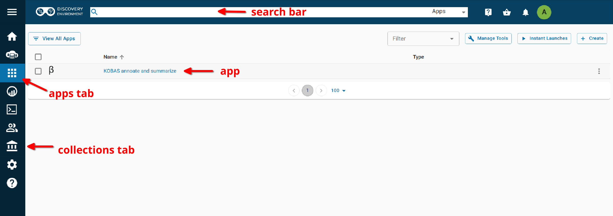
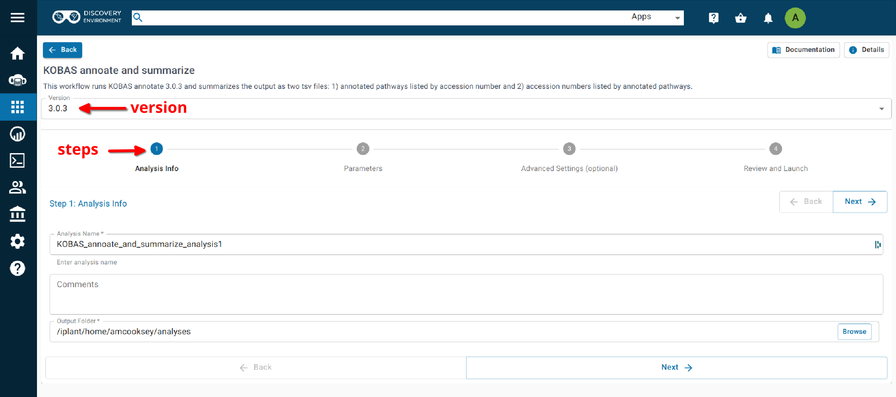
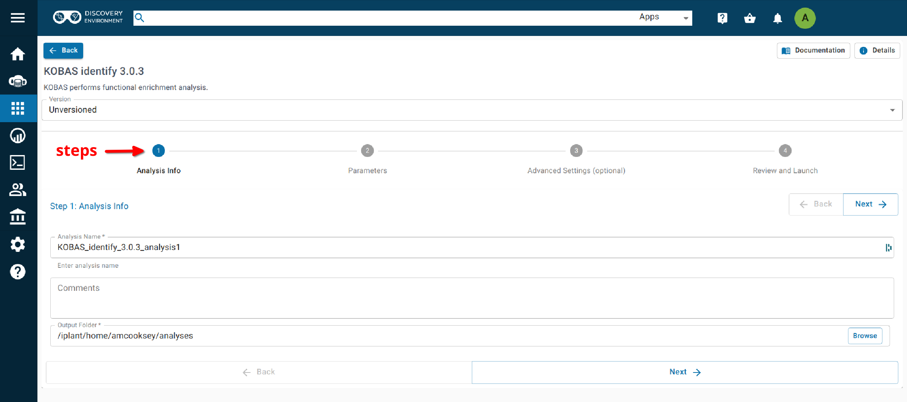
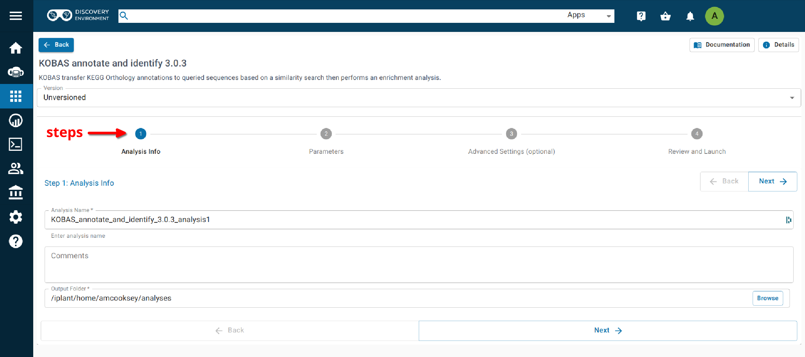

==========
**Intro**
==========

- KEGG Orthology Based Annotation System (KOBAS) is a standalone Python application.
- Consists of two modules:
    1. annotate--Assigns appropriate KO terms for queried sequences based on a similarity search.
    2. identify--Discovers enriched KO terms among the annotation results by frequency of pathways or statistical significance of pathways. 

Results and analysis from the application of KOBAS annotation to the Official gene set v3.0 protein set from *Diaphorina citri* followed by a differential expression analysis was presented at a seminar in the University of Arizona Animal and Comparative Biomedical Sciences in Fall 2020. The `slides <https://www.slideshare.net/suryasaha/functional-annotation-of-invertebrate-genomes>`_ and `video <https://arizona.zoom.us/rec/play/tZZ-fuutrj43T9fBtASDAaR9W9S0fP6s1XQbrvQOz0e0VnYHYVL1MOMaZ-F4v45qOmXQkV1MUXQ7tufD>`_ are available online.

**Where to Find KOBAS** 
=======================

KOBAS is provided as a Docker container for use on the command line and as a group of apps in the CyVerse Discovery Environment. 

- `Docker Hub <https://hub.docker.com/r/agbase/kobas>`_

- `KOBAS annotate 3.0.3 <https://de.cyverse.org/apps/de/70cdfb64-e83a-11ec-9ecf-008cfa5ae621>`_

- `KOBAS identify 3.0.3 <https://de.cyverse.org/apps/de/7c7c242c-e83a-11ec-9ecf-008cfa5ae621>`_

- `KOBAS annotate and identify 3.0.3 <https://de.cyverse.org/apps/de/77330af8-e83a-11ec-9ecf-008cfa5ae621>`_

- `KOBAS annotate and summarize  <https://de.cyverse.org/apps/de/71cb43ba-cd8a-11ed-90f2-008cfa5ae621>`_

- `KOBAS summary <https://de.cyverse.org/apps/de/2a0d0e7c-c417-11ed-b4a3-008cfa5ae621>`_

.. NOTE::

    Each of these tools accepts a protein FASTA file. For those users with nucloetide sequences some documentation has been provided for using **TransDecoder** (although other tools are also acceptable). 
    The `TransDecoder app <https://de.cyverse.org/apps/de/74828a18-f351-11e8-be2b-008cfa5ae621>`_ is available through CyVerse or as a `BioContainer <https://quay.io/repository/biocontainers/transdecoder?tab=tags>`_ for use on the command line.

**Getting the KOBAS Databases**
===============================

.. IMPORTANT::

    **As of version 3.0.3_3 you no longer need to download the seq_pep and sqlite3 databases** before you run KOBAS on the command line.

    **If you would like to download them** they are still available in the CyVerse Data Store. The CyVerse files can be downloaded with wget, curl or `iCommands <https://cyverse-data-store-guide.readthedocs-hosted.com/en/latest/step2.html>`_.

    With wget (copy the **public link** from the three dots menu to the right of the file name in the Discovery Environment):

    .. code-block:: bash

        wget https://data.cyverse.org/dav-anon/iplant/projects/iplantcollaborative/protein_blast_dbs/kobas/sqlite3.tar

    **Or** with curl (copy the **public link** from the three dots menu to the right of the file name in the Discovery Environment):

    .. code-block:: bash

        curl -o sqlite3.tar https://data.cyverse.org/dav-anon/iplant/projects/iplantcollaborative/protein_blast_dbs/kobas/sqlite3.tar

    **Or** with iCommnads copy the file **path** from the three dots menu to the right of then file name in the Discovery Environment

    .. code-block:: bash

        iget /iplant/home/shared/iplantcollaborative/protein_blast_dbs/kobas/sqlite3.tar

    Once you have the tar files you can extract all the contents or only those you wish using tar. There is no need to unzip the .gz files before you run the tool.

**Help and Usage Statement**
============================
On the command line the following help statement can be displayed with the option '-h'.

.. code-block:: none

    Options:
    [-h prints this help statement]

    [-a runs KOBAS annotate]
    KOBAS annotate options:
        -i INFILE can be FASTA or one-per-lineidentifiers. See -t intype for details.
        -s SPECIES 3 or 4 letter species abbreviation (can be found here: ftp://ftp.cbi.pku.edu.cn/pub/KOBAS_3.0_DOWNLOAD/species_abbr.txt or here: https://www.kegg.jp/kegg/catalog/org_list.html)
        -o OUTPUT file (Default is stdout.)
        -t INTYPE (fasta:pro, fasta:nuc, blastout:xml, blastout:tab, id:ncbigi, id:uniprot, id:ensembl, id:ncbigene), default fasta:pro
        [-l LIST available species, or list available databases for a specific species]
        [-e EVALUE expect threshold for BLAST, default 1e-5]
        [-r RANK rank cutoff for valid hits from BLAST result, default is 5]
        [-C COVERAGE subject coverage cutoff for BLAST, default 0]
        [-z ORTHOLOG whether only use orthologs for cross-species annotation or not, default NO (if only using orthologs, please provide the species abbreviation of your input)]
        [-k KOBAS HOME The path to kobas_home, which is the parent directory of sqlite3/ and seq_pep/. This is the absolute path in the container.]
        [-v BLAST HOME The path to blast_home, which is the parent directory of blastx and blastp. This is the absolute path in the container.]
        [-y BLASTDB The path to seq_pep/. This is the absolute path in the container.]
        [-q KOBASDB The path to sqlite3/, This is the absolute path in the container.]
        [-p BLASTP The path to blastp. This is the absolute path in the container.]
        [-x BLASTX The path to blastx. This is the absolute path in the container.]
        [-T number of THREADS to use in BLAST search. Default = 8]

    [-g runs KOBAS identify]
        KOBAS identify options:
        -f FGFILE foreground file, the output of annotate
        -b BGFILE background file, species abbreviation, see this list for species codes: https://www.kegg.jp/kegg/catalog/org_list.html
        -o OUTPUT file (Default is stdout.)
        [-d DB databases for selection, 1-letter abbreviation separated by "/": K for KEGG PATHWAY, n for PID, b for BioCarta, R for Reactome, B for BioCyc, p for PANTHER,
               o for OMIM, k for KEGG DISEASE, f for FunDO, g for GAD, N for NHGRI GWAS Catalog and G for Gene Ontology, default K/n/b/R/B/p/o/k/f/g/N/]
        [-m METHOD choose statistical test method: b for binomial test, c for chi-square test, h for hypergeometric test / Fisher's exact test, and x for frequency list,
               default hypergeometric test / Fisher's exact test
        [-n FDR choose false discovery rate (FDR) correction method: BH for Benjamini and Hochberg, BY for Benjamini and Yekutieli, QVALUE, and None, default BH
        [-c CUTOFF terms with less than cutoff number of genes are not used for statistical tests, default 5]
        [-k KOBAS HOME The path to kobas_home, which is the parent directory of sqlite3/ and seq_pep/. This is the absolute path in the container.]
        [-v BLAST HOME The path to blast_home, which is the parent directory of blastx and blastp. This is the absolute path in the container.]
        [-y BLASTDB The path to seq_pep/. This is the absolute path in the container.]
        [-q KOBASDB The path to sqlite3/. This is the absolute path in the container.]
        [-p BLASTP The path to blastp. This is the absolute path in the container.]
        [-x BLASTX The path to blastx. This is the absolute path in the container.]

    [-j runs both KOBAS annotate and identify]
======================================
**KOBAS on the Command Line**
======================================

**Getting the databases**
==========================

`No longer required as of version 3.0.3_3 <file:///home/amcooksey/Documents/USDA_i5K/Docs/_build/kobas/intro.html#getting-the-kobas-databases>`_.

**Container Technologies**
===========================
KOBAS is provided as a Docker container.

A container is a standard unit of software that packages up code and all its dependencies so the application runs quickly and reliably from one computing environment to another.

There are two major containerization technologies: **Docker** and **Apptainer (Singularity)**.

Docker containers can be run with either technology.

**Running KOBAS using Docker**
==============================
.. admonition:: About Docker

    - Docker must be installed on the computer you wish to use for your analysis.
    - To run Docker you must have ‘root’ (admin) permissions (or use sudo).
    - Docker will run all containers as ‘root’. This makes Docker incompatible with HPC systems (see Singularity below).
    - Docker can be run on your local computer, a server, a cloud virtual machine etc. 
    - For more information on installing Docker on other systems:  `Installing Docker <https://docs.docker.com/engine/install/>`_.

**Getting the KOBAS container**
-------------------------------
The KOBAS tool is available as a Docker container on Docker Hub:
`KOBAS container <https://hub.docker.com/r/agbase/kobas>`_

The container can be pulled with this command:

.. code-block:: bash

    docker pull agbase/kobas:3.0.3_3

.. admonition:: Remember

    You must have root permissions or use sudo, like so:

    sudo docker pull agbase/kobas:3.0.3_3

**Getting the Help and Usage Statement**
^^^^^^^^^^^^^^^^^^^^^^^^^^^^^^^^^^^^^^^^

.. code-block:: bash

    sudo docker run --rm agbase/kobas:3.0.3_3 -h

.. tip::

    The /work-dir directory is built into this container and should be used to mount your data.

KOBAS can perform two tasks
- annotate (-a)
- identify (enrichment) (-g)

KOBAS can also run both tasks with a single command (-j).

**Annotate Example Command**
^^^^^^^^^^^^^^^^^^^^^^^^^^^^

.. code-block:: bash

    sudo docker run \
    --rm \
    -v $(pwd):/work-dir \
    agbase/kobas:3.0.3_3 \
    -a \
    -i GCF_001298625.1_SEUB3.0_protein.faa \
    -s sce \
    -t fasta:pro \
    -o GCF_001298625.1

**Command Explained**
""""""""""""""""""""""

**sudo docker run:** tells docker to run

**--rm:** removes the container when the analysis has finished. The image will remain for future use.

**-v $(pwd):/work-dir:** mounts my current working directory on the host machine to '/work-dir' inside the container

**agbase/kobas:3.0.3_3:** the name of the Docker image to use

.. tip::

    All the options supplied after the image name are KOBAS options

**-a:** Tells KOBAS to run the 'annotate' process.

**-i GCF_001298625.1_SEUB3.0_protein.faa:** input file (protein FASTA).

**-s sce:** Enter the species code for the species of the sequences in your input file.

.. NOTE::

    If you don't know the code for your species it can be found here: https://www.kegg.jp/kegg/catalog/org_list.html

    If your species of interest is not available then you should choose the code for the closest-related species available

**-t:** input file type; in this case, protein FASTA.

**-o GCF_001298625.1:** prefix for the output file names

Reference `Understanding results`_.

**Identify Example Command**
^^^^^^^^^^^^^^^^^^^^^^^^^^^^

.. code-block:: bash

    sudo docker run \
    --rm \
    -v $(pwd):/work-dir \
    agbase/kobas:3.0.3_3 \
    -g \
    -f GCF_001298625.1_SEUB3.0_protein.faa \
    -b sce \
    -o ident_out

**Command Explained**
"""""""""""""""""""""""""""""""""

**sudo docker run:** tells docker to run

**--rm:** removes the container when the analysis has finished. The image will remain for future use.

**-v $(pwd):/work-dir:** mounts my current working directory on the host machine to '/work-dir' in the container

**agbase/kobas:3.0.3_3:** the name of the Docker image to use

.. tip::

    All the options supplied after the image name are KOBAS options

**-g:** Tells KOBAS to runt he 'identify' process.

**-f GCF_001298625.1_SEUB3.0_protein.faa:** output file from KOBAS annotate

**-b sce:** background; enter the species code for the species of the sequences in your input file.

.. NOTE::

    If you don't know the code for your species it can be found here: https://www.kegg.jp/kegg/catalog/org_list.html

    If your species of interest is not available then you should choose the code for the closest-related species available

**-o ident_out:** basename of output file

Reference `Understanding results`_.

**Annotate and Identify Pipeline Example Command**
^^^^^^^^^^^^^^^^^^^^^^^^^^^^^^^^^^^^^^^^^^^^^^^^^^

.. code-block:: bash

    sudo docker run \
    --rm \
    -v $(pwd):/work-dir \
    agbase/kobas:3.0.3_3 \
    -j \
    -i GCF_001298625.1_SEUB3.0_protein.faa \
    -s sce \
    -t fasta:pro
    -o GCF_001298625.1

**Command Explained**
"""""""""""""""""""""

**sudo docker run:** tells docker to run

**--rm:** removes the container when the analysis has finished. The image will remain for future use.

**-v $(pwd):/work-dir:** mounts my current working directory on the host machine to '/work-dir' in the container

**agbase/kobas:3.0.3_3:** the name of the Docker image to use

.. tip::

    All the options supplied after the image name are KOBAS options

**-j:** Tells KOBAS to run both the 'annotate' and 'identify' processes.

**-i GCF_001298625.1_SEUB3.0_protein.faa:** input file (protein FASTA)

**-s sce:** Enter the species code for the species of the sequences in your input file.

.. NOTE::

    If you don't know the code for your species it can be found here: https://www.kegg.jp/kegg/catalog/org_list.html

    If your species of interest is not available then you should choose the code for the closest-related species available

**-t:** input file type; in this case, protein FASTA.

**-o GCF_001298625.1:** basename of output files

.. NOTE::

    This pipeline will automatically use the output of 'annotate' as the -f foreground input for 'identify'.
    This will also use your species option as the -b background input for 'identify'.

Reference `Understanding results`_.

**Running KOBAS using Singularity**
============================================
.. admonition:: About Singularity (now Apptainer)

    - does not require ‘root’ permissions
    - runs all containers as the user that is logged into the host machine
    - HPC systems are likely to have Singularity installed and are unlikely to object if asked to install it (no guarantees).
    - can be run on any machine where it is installed
    - more information about `installing Singularity <https://apptainer.org/docs-legacy>`_
    - This tool was tested using Singularity 3.10.2.

.. admonition:: HPC Job Schedulers

    Although Singularity can be installed on any computer this documentation assumes it will be run on an HPC system. The tool was tested on a Slurm system and the job submission scripts below reflect that. Submission scripts will need to be modified for use with other job scheduler systems.

**Getting the KOBAS container**
-------------------------------
The KOBAS tool is available as a Docker container on Docker Hub:
`KOBAS container <https://hub.docker.com/r/agbase/kobas>`_

**Example Slurm script:**

.. code-block:: bash

    #!/bin/bash
    #SBATCH --job-name=kobas
    #SBATCH --ntasks=8
    #SBATCH --time=2:00:00
    #SBATCH --partition=short
    #SBATCH --account=nal_genomics

    module load singularity

    cd /location/where/your/want/to/save/file

    singularity pull docker://agbase/kobas:3.0.3_3

**Running KOBAS with Data**
---------------------------

.. tip::

    There /work-dir directory is built into this container and should be used to mount data.

**Example Slurm Script for Annotate Process**
^^^^^^^^^^^^^^^^^^^^^^^^^^^^^^^^^^^^^^^^^^^^^

.. code-block:: bash

    #!/bin/bash
    #SBATCH --job-name=kobas
    #SBATCH --ntasks=8
    #SBATCH --time=2:00:00
    #SBATCH --partition=short
    #SBATCH --account=nal_genomics

    module load singularity

    cd /directory/you/want/to/work/in

    singularity run \
    -B /directory/you/want/to/work/in:/work-dir \
    /path/to/your/copy/kobas_3.0.3_3.sif \
    -a \
    -i GCF_001298625.1_SEUB3.0_protein.faa \
    -s sce \
    -t fasta:pro \
    -o GCF_001298625.1

**Command Explained**
"""""""""""""""""""""

**singularity run:** tells Singularity to run

**-B /project/nal_genomics/amanda.cooksey/protein_sets/saceub/KOBAS:/work-dir:** mounts my current working directory on the host machine to '/work-dir' in the container

**/path/to/your/copy/kobas_3.0.3_3.sif:** the name of the Singularity image to use

.. tip::

    All the options supplied after the image name are KOBAS options

**-a:** Tells KOBAS to run the 'annotate' process.

**-i GCF_001298625.1_SEUB3.0_protein.faa:** input file (protein FASTA)

**-s sce:** Enter the species for the species of the sequences in your input file.

.. NOTE::

    If you don't know the code for your species it can be found here: https://www.kegg.jp/kegg/catalog/org_list.html

    If your species of interest is not available then you should choose the code for the closest-related species available

**-t:** input file type; in this case, protein FASTA.

**-o GCF_001298625.1:** name of output file

Reference `Understanding results`_.

**Example Slurm Script for Identify Process**
^^^^^^^^^^^^^^^^^^^^^^^^^^^^^^^^^^^^^^^^^^^^^

.. code-block:: bash

    #!/bin/bash
    #SBATCH --job-name=kobas
    #SBATCH --ntasks=8
    #SBATCH --time=2:00:00
    #SBATCH --partition=short
    #SBATCH --account=nal_genomics

    module load singularity

    cd /location/where/your/want/to/save/file

    singularity pull docker://agbase/kobas:3.0.3_3

    singularity run \
    -B /directory/you/want/to/work/in:/work-dir \
    kobas_3.0.3_3.sif \
    -g \
    -f GCF_001298625.1_SEUB3.0_protein.faa \
    -b sce \
    -o ident_out

**Command Explained**
"""""""""""""""""""""

**singularity run:** tells Singularity to run

**-B /project/nal_genomics/amanda.cooksey/protein_sets/saceub/KOBAS:/work-dir:** mounts my current working directory on the host machine to '/work-dir' in the container

**kobas_3.0.3_3.sif:** the name of the Singularity image to use

.. tip::

    All the options supplied after the image name are KOBAS options

**-g:** Tells KOBAS to run the 'identify' process.

**-f GCF_001298625.1_SEUB3.0_protein.faa:** output file from 'annotate'

**-b sce:** background; enter the species for the species of the sequences in your input file.

.. NOTE::

    If you don't know the code for your species it can be found here: https://www.kegg.jp/kegg/catalog/org_list.html

    If your species of interest is not available then you should choose the code for the closest-related species available

**-o ident_out:** name of output file

Reference `Understanding results`_.

**Example Slurm Script for Annotate and Identify Pipeline**
^^^^^^^^^^^^^^^^^^^^^^^^^^^^^^^^^^^^^^^^^^^^^^^^^^^^^^^^^^^

.. code-block:: bash

    #!/bin/bash
    #SBATCH --job-name=kobas
    #SBATCH --ntasks=8
    #SBATCH --time=2:00:00
    #SBATCH --partition=short
    #SBATCH --account=nal_genomics

    module load singularity

    cd /location/where/your/want/to/save/file

    singularity pull docker://agbase/kobas:3.0.3_3

    singularity run \
    -B /directory/you/want/to/work/in:/work-dir \
    kobas_3.0.3_3.sif \
    -j \
    -i GCF_001298625.1_SEUB3.0_protein.faa \
    -s sce \
    -t fasta:pro \
    -o GCF_001298625.1

**Command Explained**
""""""""""""""""""""""

**singularity run:** tells Singularity to run

**-B /rsgrps/shaneburgess/amanda/i5k/kobas:/work-dir:** mounts my current working directory on the host machine to '/work-dir' in the container

**kobas_3.0.3_3.sif:** the name of the Singularity image to use

.. tip::

    All the options supplied after the image name are KOBAS options

**-j:** Tells KOBAS to runt he 'annotate' process.

**-i GCF_001298625.1_SEUB3.0_protein.faa:** input file (protein FASTA)

**-s sce:** Enter the species for the species of the sequences in your input file.

.. NOTE::

    If you don't know the code for your species it can be found here: https://www.kegg.jp/kegg/catalog/org_list.html

    If your species of interest is not available then you should choose the code for the closest-related species available

**-t:** input file type; in this case, protein FASTA.

**-o GCF_001298625.1:** name of output file

.. NOTE::

    This pipeline will automatically use the output of 'annotate' as the -f foreground input for 'identify'.
    This will also use your species option as the -b background input for 'identify'.

.. _Understanding results:

**Understanding Your Results**
==============================

**Annotate**
------------

If all goes well, you should get the following:

- **<species>.tsv:** This is the tab-separated output from the BLAST search. It is unlikely that you will need to look at this file.
- **<basename>:** KOBAS-annotate generates a text file with the name you provide. It has two sections (detailed below).
- **<basename>_KOBAS_acc_pathways.tsv:** Our post-processing script creates this tab-separated file. It lists each accession from your data and all of the pathways to which they were annotated.
- **<basename>_KOBAS_pathways_acc.tsv:** Our post-processing script creates this tab-separated file. It lists each pathway annotated to your data with all of the accessions annotated to that pathway.

The <basename> file has two sections.
The first section looks like this:

.. code-block:: bash

    #Query	Gene ID|Gene name|Hyperlink
    XP_018220118.1	sce:YMR059W|SEN15|http://www.genome.jp/dbget-bin/www_bget?sce:YMR059W
    XP_018221352.1	sce:YJR050W|ISY1, NTC30, UTR3|http://www.genome.jp/dbget-bin/www_bget?sce:YJR050W
    XP_018224031.1	sce:YDR513W|GRX2, TTR1|http://www.genome.jp/dbget-bin/www_bget?sce:YDR513W
    XP_018222559.1	sce:YFR024C-A|LSB3, YFR024C|http://www.genome.jp/dbget-bin/www_bget?sce:YFR024C-A
    XP_018221254.1	sce:YJL070C||http://www.genome.jp/dbget-bin/www_bget?sce:YJL070C

The second section follows a dashed line and looks like this:

.. code-block:: bash

    ////
    Query:                  XP_018222878.1
    Gene:                   sce:YDL220C     CDC13, EST4
    Entrez Gene ID:         851306
    ////
    Query:                  XP_018219412.1
    Gene:                   sce:YOR204W     DED1, SPP81
    Entrez Gene ID:         854379
    Pathway:                Innate Immune System    Reactome        R-SCE-168249
                            Immune System   Reactome        R-SCE-168256
                            Neutrophil degranulation        Reactome        R-SCE-6798695

<basename>_KOBAS_acc_pathways.tsv looks like this:

.. code-block:: bash

    XP_018220118.1	BioCyc:PWY-6689
    XP_018221352.1	Reactome:R-SCE-6782135,KEGG:sce03040,Reactome:R-SCE-73894,Reactome:R-SCE-5696398,Reactome:R-SCE-6782210,Reactome:R-SCE-6781827
    XP_018224031.1	BioCyc:GLUT-REDOX-PWY,BioCyc:PWY3O-592

<basename>_KOBAS_pathways_acc.tsv looks like this:

.. code-block:: bash

    BioCyc:PWY3O-0  XP_018222002.1,XP_018222589.1
    KEGG:sce00440   XP_018222406.1,XP_018219751.1,XP_018222229.1
    Reactome:R-SCE-416476   XP_018223583.1,XP_018221814.1,XP_018222685.1,XP_018220832.1,XP_018219073.1,XP_018218776.1,XP_018223466.1,XP_018223545.1,XP_018222256.1
    Reactome:R-SCE-418346   XP_018220070.1,XP_018221774.1,XP_018221826.1,XP_018220071.1,XP_018222218.1,XP_018220541.1,XP_018219550.1

.. _identifyresults:

**Identify**
------------

If all goes well, you should get the following:

- **<output_file_name_you_provided>:** KOBAS identify generates a text file with the name you provide.

.. code-block:: bash

    ##Databases: PANTHER, KEGG PATHWAY, Reactome, BioCyc
    ##Statistical test method: hypergeometric test / Fisher's exact test
    ##FDR correction method: Benjamini and Hochberg

    #Term   Database        ID      Input number    Background number       P-Value Corrected P-Value       Input   Hyperlink
    Metabolic pathways      KEGG PATHWAY    sce01100        714     754     0.00303590229485        0.575578081959  XP_018221856.1|XP_018220917.1|XP_018222719.1|...link
    Metabolism      Reactome        R-SCE-1430728   419     438     0.0147488189928 0.575578081959  XP_018221856.1|XP_018221742.1|XP_018219354.1|XP_018221740.1|...link
    Immune System   Reactome        R-SCE-168256    304     315     0.0267150787723 0.575578081959  XP_018223955.1|XP_018222962.1|XP_018223268.1|XP_018222956.1|...link

`Contact us <agbase@email.arizona.edu>`_.

======================================
**KOBAS on the ARS Ceres HPC**
======================================

**About Ceres/Scinet**
===============================
- The Scinet VRSC has installed KOBAS for ARS use.
- For general information on Scinet/Ceres, how to access it, and how to use it, visit `https://usda-ars-gbru.github.io/scinet-site/ <https://usda-ars-gbru.github.io/scinet-site/>`_.

**Getting the databases**
==========================
To run the tool you need some public data in your working directory. The files can be downloaded directly from the `KOBAS homepage <kobas.cbi.pku.edu.cn>`_. These directories are also available on Ceres/Scinet under /reference/data/iplant/2019-09-16/kobas. This directory will need to be **copied** to your working directory, since KOBAS requires write-access to the subdirectories within this folder. 

1) seq_pep/: species-specific BLAST databases used by KOBAS

.. code-block:: bash

    cp -r /reference/data/iplant/2019-09-16/kobas/seq_pep/ .
    chmod -R 777 seq_pep

2) sqlite3: species-specific annotation databases used by KOBAS

.. code-block:: bash

    cp -r /reference/data/iplant/2019-09-16/kobas/sqlite3/ .
    chmod -R 777 sqlite3

.. NOTE::

    The above commands should result in two directories (seq_pep and sqlite3) each containing many files. There is no need to unzip the .gz files.

**Running KOBAS on Ceres**
==============================
.. admonition:: Running programs on Ceres/Scinet

    - You'll need to run KOBAS either in interactive mode or batch mode.
    - For interactive mode, use the `salloc` command.
    - For batch mode, you'll need to write a batch job submission bash script.

**Running KOBAS in interactive mode**
--------------------------------------

**Loading the module**
^^^^^^^^^^^^^^^^^^^^^^

The Scinet VRSC has installed the KOBAS program. To load the module in interactive mode, run the command

.. code-block:: bash

    module load agbase

**Getting the Help and Usage Statement**
^^^^^^^^^^^^^^^^^^^^^^^^^^^^^^^^^^^^^^^^

.. code-block:: bash

    kobas -h

See :ref:`kobasusage`

KOBAS can perform two tasks:
- annotate (-a)
- identify (enrichment) (-g)
KOBAS can also run both task with a single command (-j).

**Annotate Example Command - interactive mode**
^^^^^^^^^^^^^^^^^^^^^^^^^^^^^^^^^^^^^^^^^^^^^^^

.. code-block:: none

    kobas -a -i AROS_10.faa -s dme -t fasta:pro -o kobas_output -k /project/nal_genomics/monica.poelchau

**Annotate Example Command - batch mode**
^^^^^^^^^^^^^^^^^^^^^^^^^^^^^^^^^^^^^^^^^
.. admonition:: Running programs on Ceres/Scinet in batch mode

    - Before using batch mode, you should review Ceres/Scinet's documentation first, and decide what queue you'll want to use. See `https://usda-ars-gbru.github.io/scinet-site/guide/ceres/ <https://usda-ars-gbru.github.io/scinet-site/guide/ceres/>`_.

**Example batch job submission bash script (e.g. kobas-job.sh):**

.. code-block:: bash

    #! /bin/bash
    module load agbase
    kobas -a -i AROS_10.faa -s dme -t fasta:pro -o kobas_output -k /project/nal_genomics/monica.poelchau

**Submitting the batch job:**

.. code-block:: bash

    sbatch kobas-job.sh

**Command Explained**
""""""""""""""""""""""

**-a:** Tells KOBAS to run the 'annotate' process.

**-i AROS_10.faa:** input file (peptide FASTA)

**-s dme:** Enter the species for the species of the sequences in your input file. 

.. NOTE:: 

    If you don't know the code for your species it can be found here: https://www.kegg.jp/kegg/catalog/org_list.html

    If your species of interest is not available then you should choose the code for the closest-related species available

**-t:** input file type; in this case, protein FASTA.

**-o kobas_output:** name of output file

**-k /project/nal_genomics/monica.poelchau:** KOBAS HOME. The path to kobas_home, which is the parent directory of sqlite3/ and seq_pep/.

For information on output files see :ref:`Understanding Your Results: Annotate <annotateresults>`

**Identify Example Command - interactive mode**
^^^^^^^^^^^^^^^^^^^^^^^^^^^^^^^^^^^^^^^^^^^^^^^
.. code-block:: none

    kobas -g -f kobas_output -b dme -k /project/nal_genomics/monica.poelchau -o ident_out

**Annotate Example Command - batch mode**
^^^^^^^^^^^^^^^^^^^^^^^^^^^^^^^^^^^^^^^^^
.. admonition:: Running programs on Ceres/Scinet in batch mode

    - Before using batch mode, you should review Ceres/Scinet's documentation first, and decide what queue you'll want to use. See `https://usda-ars-gbru.github.io/scinet-site/guide/ceres/ <https://usda-ars-gbru.github.io/scinet-site/guide/ceres/>`_.

**Example batch job submission bash script (e.g. kobas-job.sh):**

.. code-block:: bash

    #! /bin/bash
    module load agbase
    kobas -g -f kobas_output -b dme -k /project/nal_genomics/monica.poelchau -o ident_out

**Submitting the batch job:**

.. code-block:: bash

    sbatch kobas-job.sh

**Command Explained**
"""""""""""""""""""""""""""""""""

**-g:** Tells KOBAS to runt he 'identify' process.

**-f kobas_output:** output file from KOBAS annotate

**-b dme:** background; enter the species code for the species of the sequences in your input file. 

.. NOTE:: 

    If you don't know the code for your species it can be found here: https://www.kegg.jp/kegg/catalog/org_list.html

    If your species of interest is not available then you should choose the code for the closest-related species available

**-o ident_out:** name of output file

For information on outputs see :ref:`Understanding Your Results: Identify <identifyresults>`

**Annotate and Identify Pipeline Example Command - interactive mode**
^^^^^^^^^^^^^^^^^^^^^^^^^^^^^^^^^^^^^^^^^^^^^^^^^^^^^^^^^^^^^^^^^^^^^
.. code-block:: none

    kobas -j -i AROS_10.faa -s dme -t fasta:pro -k /project/nal_genomics/monica.poelchau -o kobas_output

**Annotate Example Command - batch mode**
^^^^^^^^^^^^^^^^^^^^^^^^^^^^^^^^^^^^^^^^^
.. admonition:: Running programs on Ceres/Scinet in batch mode

    - Before using batch mode, you should review Ceres/Scinet's documentation first, and decide what queue you'll want to use. See `https://usda-ars-gbru.github.io/scinet-site/guide/ceres/ <https://usda-ars-gbru.github.io/scinet-site/guide/ceres/>`_.

**Example batch job submission bash script (e.g. kobas-job.sh):**

.. code-block:: bash

    #! /bin/bash
    module load agbase
    kobas -j -i AROS_10.faa -s dme -t fasta:pro -k /project/nal_genomics/monica.poelchau -o kobas_output

**Submitting the batch job:**

.. code-block:: bash

    sbatch kobas-job.sh

**Command Explained**
"""""""""""""""""""""

**-j:** Tells KOBAS to runt he 'annotate' process.

**-i AROS_10.faa:** input file (peptide FASTA)

**-s dme:** Enter the species for the species of the sequences in your input file. 

.. NOTE:: 

    If you don't know the code for your species it can be found here: https://www.kegg.jp/kegg/catalog/org_list.html

    If your species of interest is not available then you should choose the code for the closest-related species available

**-t:** input file type; in this case, protein FASTA.

**-o kobas_output:** basename of output files

.. NOTE::

    This pipeline will automatically use the output of 'annotate' as the -f foreground input for 'identify. 
    This will also use your species option as the -b background input for 'identify'.

For more information on outputs see :ref:`Understanding Your Results: Annotate and Identify <annoident>`

**Understanding Your Results**
==============================

.. _annotateresults:

**Annotate**
------------

If all goes well, you should get the following:

- **seq_pep folder:** This folder contains the BLAST database files used in your analysis.
- **sqlite3 folder:** This folder contains the annotation database files used in your analysis
- **<species>.tsv:** This is the tab-delimited output from the BLAST search. It is unlikely that you will need to look at this file.
- **<output_file_name_you_provided>:** KOBAS-annotate generates a text file with the name you provide. It has two sections. 

The first sections looks like this:

.. code-block:: none

    ##dme	Drosophila melanogaster (fruit fly)
    ##Method: BLAST	Options: evalue <= 1e-05
    ##Summary:	87 succeed, 0 fail

    #Query	Gene ID|Gene name|Hyperlink
    lcl|NW_020311285.1_prot_XP_012256083.1_15	dme:Dmel_CG34349|Unc-13-4B|http://www.genome.jp/dbget-bin/www_bget?dme:Dmel_CG34349
    lcl|NW_020311286.1_prot_XP_020708336.1_46	dme:Dmel_CG6963|gish|http://www.genome.jp/dbget-bin/www_bget?dme:Dmel_CG6963
    lcl|NW_020311285.1_prot_XP_020707987.1_39	dme:Dmel_CG30403||http://www.genome.jp/dbget-bin/www_bget?dme:Dmel_CG30403
    
The second section follows a dashed line and looks like this:

.. code-block:: none

    --------------------

    ////
    Query:              	lcl|NW_020311285.1_prot_XP_012256083.1_15
    Gene:               	dme:Dmel_CG34349	Unc-13-4B
    Entrez Gene ID:      	43002
    ////
    Query:              	lcl|NW_020311286.1_prot_XP_020708336.1_46
    Gene:               	dme:Dmel_CG6963	gish
    Entrez Gene ID:      	49701
    Pathway:            	Hedgehog signaling pathway - fly	KEGG PATHWAY	dme04341
    ////
    Query:              	lcl|NW_020311285.1_prot_XP_020707987.1_39
    Gene:               	dme:Dmel_CG30403	
    Entrez Gene ID:      	246595
    ////
    Query:              	lcl|NW_020311285.1_prot_XP_020707989.1_40
    Gene:               	dme:Dmel_CG6148	Past1
    Entrez Gene ID:      	41569
    Pathway:            	Endocytosis	KEGG PATHWAY	dme04144
                                Hemostasis	Reactome	R-DME-109582
                    	        Factors involved in megakaryocyte development and platelet production	Reactome	R-DME-98323

.. _identifyresults:

**Identify**
------------

If all goes well, you should get the following:

- **sqlite3 folder:** This folder contains the annotation database files used in your analysis

- **<output_file_name_you_provided>:** KOBAS identify generates a text file with the name you provide.

.. code-block:: none

    ##Databases: PANTHER, KEGG PATHWAY, Reactome, BioCyc
    ##Statistical test method: hypergeometric test / Fisher's exact test
    ##FDR correction method: Benjamini and Hochberg

    #Term	Database	ID	Input number	Background number	P-Value	Corrected P-Value	Input	Hyperlink
    Hedgehog signaling pathway - fly	KEGG PATHWAY	dme04341	12	33	3.20002656734e-18	1.76001461204e-16	lcl|NW_020311286.1_prot_XP_012256678.1_51|lcl|NW_020311286.1_prot_XP_025602973.1_48|lcl|NW_020311286.1_prot_XP_012256683.1_52|lcl|NW_020311286.1_prot_XP_012256679.1_55|lcl|NW_020311286.1_prot_XP_012256674.1_54|lcl|NW_020311286.1_prot_XP_020708336.1_46|lcl|NW_020311285.1_prot_XP_012256108.1_32|lcl|NW_020311286.1_prot_XP_012256682.1_53|lcl|NW_020311286.1_prot_XP_025603025.1_47|lcl|NW_020311286.1_prot_XP_020708334.1_49|lcl|NW_020311285.1_prot_XP_012256109.1_33|lcl|NW_020311286.1_prot_XP_020708333.1_50	http://www.genome.jp/kegg-bin/show_pathway?dme04341/dme:Dmel_CG6963%09red/dme:Dmel_CG6054%09red
    Hedgehog signaling pathway	PANTHER	P00025	6	13	3.6166668094e-10	9.94583372585e-09	lcl|NW_020311286.1_prot_XP_025602279.1_78|lcl|NW_020311286.1_prot_XP_025602289.1_76|lcl|NW_020311286.1_prot_XP_025602264.1_79|lcl|NW_020311285.1_prot_XP_012256108.1_32|lcl|NW_020311285.1_prot_XP_012256109.1_33|lcl|NW_020311286.1_prot_XP_012256943.1_77	http://www.pantherdb.org/pathway/pathwayDiagram.jsp?catAccession=P00025
    Signaling by NOTCH2	Reactome	R-DME-1980145	3	8	2.00259649553e-05	0.000275357018136	lcl|NW_020311285.1_prot_XP_012256118.1_28|lcl|NW_020311285.1_prot_XP_012256117.1_27|lcl|NW_020311285.1_prot_XP_012256119.1_26	http://www.reactome.org/cgi-bin/eventbrowser_st_id?ST_ID=R-DME-1980145

.. _annoident:

**Annotate and Identify Pipeline**
----------------------------------

If all goes well, you should get the following:

- **logs folder:** This folder contains the 'conder_stderr' and 'condor_stdout' files. The files record feedback, progress and, importantly, any errors the app encountered during the analysis. You won't normally need to look at these but they are very helpful in figuring out what may have happened if your output doesn't look like you expected.

- **sqlite3 folder:** This folder contains the annotation database files used in your analysis

- **seq_pep folder:** This folder contains the BLAST database files used in your analysis.

- **<species>.tsv:** This is the tab-delimited output from the BLAST search. It is unlikely that you will need to look at this file.

- **<basename>_annotate_out.txt:** KOBAS annotate generates a text file with the name you provide. It has two sections. 

The first sections looks like this:

.. code-block:: none

    ##dme	Drosophila melanogaster (fruit fly)
    ##Method: BLAST	Options: evalue <= 1e-05
    ##Summary:	87 succeed, 0 fail

    #Query	Gene ID|Gene name|Hyperlink
    lcl|NW_020311285.1_prot_XP_012256083.1_15	dme:Dmel_CG34349|Unc-13-4B|http://www.genome.jp/dbget-bin/www_bget?dme:Dmel_CG34349
    lcl|NW_020311286.1_prot_XP_020708336.1_46	dme:Dmel_CG6963|gish|http://www.genome.jp/dbget-bin/www_bget?dme:Dmel_CG6963
    lcl|NW_020311285.1_prot_XP_020707987.1_39	dme:Dmel_CG30403||http://www.genome.jp/dbget-bin/www_bget?dme:Dmel_CG30403
    
The second section follows a dashed line and looks like this:

.. code-block:: none

    --------------------

    ////
    Query:              	lcl|NW_020311285.1_prot_XP_012256083.1_15
    Gene:               	dme:Dmel_CG34349	Unc-13-4B
    Entrez Gene ID:      	43002
    ////
    Query:              	lcl|NW_020311286.1_prot_XP_020708336.1_46
    Gene:               	dme:Dmel_CG6963	gish
    Entrez Gene ID:      	49701
    Pathway:            	Hedgehog signaling pathway - fly	KEGG PATHWAY	dme04341
    ////
    Query:              	lcl|NW_020311285.1_prot_XP_020707987.1_39
    Gene:               	dme:Dmel_CG30403	
    Entrez Gene ID:      	246595
    ////
    Query:              	lcl|NW_020311285.1_prot_XP_020707989.1_40
    Gene:               	dme:Dmel_CG6148	Past1
    Entrez Gene ID:      	41569
    Pathway:            	Endocytosis	KEGG PATHWAY	dme04144
                                Hemostasis	Reactome	R-DME-109582
                    	        Factors involved in megakaryocyte development and platelet production	Reactome	R-DME-98323mel_CG6963
    lcl|NW_020311285.1_prot_XP_020707987.1_39	dme:Dmel_CG30403||http://www.genome.jp/dbget-bin/www_bget?dme:Dmel_CG30403
    

- **<basename>_identify_out.txt:** KOBAS identify generates a text file with the name you provide.

.. code-block:: none

    ##Databases: PANTHER, KEGG PATHWAY, Reactome, BioCyc
    ##Statistical test method: hypergeometric test / Fisher's exact test
    ##FDR correction method: Benjamini and Hochberg

    #Term	Database	ID	Input number	Background number	P-Value	Corrected P-Value	Input	Hyperlink
    Hedgehog signaling pathway - fly	KEGG PATHWAY	dme04341	12	33	3.20002656734e-18	1.76001461204e-16	lcl|NW_020311286.1_prot_XP_012256678.1_51|lcl|NW_020311286.1_prot_XP_025602973.1_48|lcl|NW_020311286.1_prot_XP_012256683.1_52|lcl|NW_020311286.1_prot_XP_012256679.1_55|lcl|NW_020311286.1_prot_XP_012256674.1_54|lcl|NW_020311286.1_prot_XP_020708336.1_46|lcl|NW_020311285.1_prot_XP_012256108.1_32|lcl|NW_020311286.1_prot_XP_012256682.1_53|lcl|NW_020311286.1_prot_XP_025603025.1_47|lcl|NW_020311286.1_prot_XP_020708334.1_49|lcl|NW_020311285.1_prot_XP_012256109.1_33|lcl|NW_020311286.1_prot_XP_020708333.1_50	http://www.genome.jp/kegg-bin/show_pathway?dme04341/dme:Dmel_CG6963%09red/dme:Dmel_CG6054%09red
    Hedgehog signaling pathway	PANTHER	P00025	6	13	3.6166668094e-10	9.94583372585e-09	lcl|NW_020311286.1_prot_XP_025602279.1_78|lcl|NW_020311286.1_prot_XP_025602289.1_76|lcl|NW_020311286.1_prot_XP_025602264.1_79|lcl|NW_020311285.1_prot_XP_012256108.1_32|lcl|NW_020311285.1_prot_XP_012256109.1_33|lcl|NW_020311286.1_prot_XP_012256943.1_77	http://www.pantherdb.org/pathway/pathwayDiagram.jsp?catAccession=P00025
    Signaling by NOTCH2	Reactome	R-DME-1980145	3	8	2.00259649553e-05	0.000275357018136	lcl|NW_020311285.1_prot_XP_012256118.1_28|lcl|NW_020311285.1_prot_XP_012256117.1_27|lcl|NW_020311285.1_prot_XP_012256119.1_26	http://www.reactome.org/cgi-bin/eventbrowser_st_id?ST_ID=R-DME-1980145

`Contact us <agbase@email.arizona.edu>`_.

===========================
**KOBAS on CyVerse**
===========================

**Accessing KOBAS in the Discovery Environment**
================================================

1. `Create an account on CyVerse <user.cyverse.org>`_ (free). The Discovery Environment (DE) the user guide can be found `here <https://learning.cyverse.org>`_.
2. Open the CyVerse Discovery Environment (DE) and login with your CyVerse credentials.
3. There are several ways to access the GOanna app:

- Use the `direct link <https://de.cyverse.org/apps/de/71cb43ba-cd8a-11ed-90f2-008cfa5ae621>`_.
- Search for 'KOBAS in the search bar at the top of the ‘apps’ tab.
- Follow the AgBase collection (collections tab on left side of DE)

The KOBAS apps are called:

- **NEW** `KOBAS annotate and summarize <https://de.cyverse.org/apps/de/71cb43ba-cd8a-11ed-90f2-008cfa5ae621>`_
- `KOBAS annotate 3.0.3 <https://de.cyverse.org/de/?type=apps&app-id=070f519e-983f-11e9-b659-008cfa5ae621&system-id=de>`_
- `KOBAS identify 3.0.3 <https://de.cyverse.org/de/?type=apps&app-id=9e0a429c-dee0-11e9-948a-008cfa5ae621&system-id=de>`_
- `KOBAS annotate and identify 3.0.3 <https://de.cyverse.org/de/?type=apps&app-id=2959dcb4-d0d0-11e9-9f25-008cfa5ae621&system-id=de>`_

.. admonition:: **NEW** KOBAS annotate and summarize

    The new KOBAS annotate and summarize app is version 3.0.3. In addition to the annotate function it also performs a summary step. We recommend using this app rather than the annotate 3.0.3 app.

|find_kobas|

**KOBAS annotate and summarize**
================================
**Launching the app**
---------------------

|kobas_anno|

**Step 1. Analysis Info**
^^^^^^^^^^^^^^^^^^^^^^^^^

**Analysis Name: KOBAS_annoate_and_summarize_analysis1:**
This menu is used to name the job you will run so that you can find it later.
Analysis Name: The default name is "KOBAS_annoate_and_summarize_analysis1". We recommend changing the 'analysis1' portion of this to reflect the data you are running.

**Comments:**
(Optional) You can add additional information in the comments section to distinguish your analyses further.

**Select output folder:**
This is where your results will be placed. The default (recommended) is your 'analyses' folder.

**Step 2. Parameters**
^^^^^^^^^^^^^^^^^^^^^^

**Input File:** Use the 'browse' button on the right side of the field to navigate to your input file.

**Input File Type:** Select your input file type from the drop-down list. If your file type isn't there then the app does not support that file type. 

**Species Code:** Enter the species for the species of the sequences in your input file. 

.. NOTE:: 

    If you don't know the code for your species it can be found here: https://www.kegg.jp/kegg/catalog/org_list.html 
    **Not all KEGG species are available through KOBAS.**

    If your species of interest is not available then you should choose the code for the closest-related species available

**E value:** This is the evalue to use in the BLAST search. The default is 1e-5.

**Rank:** rank cutoff for valid hits from BLAST result. Default is 5.

**Covergage:** subject coverage cutoff for BLAST. Default is 0.

**Ortholog:** when checked KOBAS will only use orthologs for cross species annotation.

**Output File Name:** Provide an output file name .

For information on outputs see :ref:`Understanding Your Results: Annotate <annotateresults>`

**Step3. Adavanced Settings (optional)**
^^^^^^^^^^^^^^^^^^^^^^^^^^^^^^^^^^^^^^^^

This page allows you specifiy compute requirements for your analysis (e.g. more memory if your analysis is particularly large). You should be able to leave the defaults for most analyses.

**Step4. Review and Launch**
^^^^^^^^^^^^^^^^^^^^^^^^^^^^

This will display all of the parameters you have set (other than default). Missing information that is required will displayed in red. Make sure you are happy with your choices and then clicke the 'launch' button at the bottom.

**Understanding Your Annotate Results**
----------------------------------------

If all goes well, you should get the following:

- **logs folder:** This folder contains the 'conder_stderr' and 'condor_stdout' files. The files record feedback, progress and, importantly, any errors the app encountered during the analysis. You won't normally need to look at these but they are very helpful in figuring out what may have happened if your output doesn't look like you expected.

- **seq_pep folder:** This folder contains the BLAST database files used in your analysis.
- **sqlite3 folder:** This folder contains the annotation database files used in your analysis
- **<species>.tsv:** This is the tab-delimited output from the BLAST search. It is unlikely that you will need to look at this file.
- **<output_prefix>.txt:** KOBAS-annotate generates a text file with the name you provide. It has two sections.
- **<output_prefix>.txt_KOBAS_acc_pathways.tsv:** A tab-delimited file with accession number and all of the annoations made to that accession.
- **<output_prefix>.txt_KOBAS_pathwyas_acc.tsv:** A tab-delimited file with pathways and of all of the accession annotated with that pathway.

The first section of <output_prefix>.txt looks like this:

.. code-block:: bash

    ##dme	Drosophila melanogaster (fruit fly)
    ##Method: BLAST	Options: evalue <= 1e-05
    ##Summary:	87 succeed, 0 fail

    #Query	Gene ID|Gene name|Hyperlink
    lcl|NW_020311285.1_prot_XP_012256083.1_15	dme:Dmel_CG34349|Unc-13-4B|http://www.genome.jp/dbget-bin/www_bget?dme:Dmel_CG34349
    lcl|NW_020311286.1_prot_XP_020708336.1_46	dme:Dmel_CG6963|gish|http://www.genome.jp/dbget-bin/www_bget?dme:Dmel_CG6963
    lcl|NW_020311285.1_prot_XP_020707987.1_39	dme:Dmel_CG30403||http://www.genome.jp/dbget-bin/www_bget?dme:Dmel_CG30403
    
The second section of <output_prefix>.txt follows a dashed line and looks like this:

.. code-block:: bash

    --------------------

    ////
    Query:              	lcl|NW_020311285.1_prot_XP_012256083.1_15
    Gene:               	dme:Dmel_CG34349	Unc-13-4B
    Entrez Gene ID:      	43002
    ////
    Query:              	lcl|NW_020311286.1_prot_XP_020708336.1_46
    Gene:               	dme:Dmel_CG6963	gish
    Entrez Gene ID:      	49701
    Pathway:            	Hedgehog signaling pathway - fly	KEGG PATHWAY	dme04341
    ////
    Query:              	lcl|NW_020311285.1_prot_XP_020707987.1_39
    Gene:               	dme:Dmel_CG30403	
    Entrez Gene ID:      	246595
    ////
    Query:              	lcl|NW_020311285.1_prot_XP_020707989.1_40
    Gene:               	dme:Dmel_CG6148	Past1
    Entrez Gene ID:      	41569
    Pathway:            	Endocytosis	KEGG PATHWAY	dme04144
                                Hemostasis	Reactome	R-DME-109582
                    	        Factors involved in megakaryocyte development and platelet production	Reactome	R-DME-98323

The <output_prefix>.txt_KOBAS_acc_pathways.tsv file looks like this:

XP_018223853.1	Reactome:R-SCE-6782135,KEGG:sce03420,Reactome:R-SCE-113418,Reactome:R-SCE-3700989,Reactome:R-SCE-73894,Reactome:R-SCE-73776,KEGG:sce03022,Reactome:R-SCE-6796648
XP_018222686.1	Reactome:R-SCE-5689603,KEGG:sce03050,Reactome:R-SCE-392499,Reactome:R-SCE-168249,Reactome:R-SCE-597592,Reactome:R-SCE-1236975,Reactome:R-SCE-1236978
XP_018223153.1	KEGG:sce01100,KEGG:sce01110,KEGG:sce01130,KEGG:sce01200,KEGG:sce01230,BioCyc:NONOXIPENT-PWY,BioCyc:PENTOSE-P-PWY,KEGG:sce00030
XP_018220571.1	KEGG:sce01100,KEGG:sce00270,KEGG:sce00480,KEGG:sce00410,KEGG:sce00330,BioCyc:ARGSPECAT-PWY

The <output_prefix>.txt_KOBAS_pathwyas_acc.tsv file looks like this:

KEGG:sce01100	XP_018223153.1,XP_018220571.1,XP_018219513.1
Reactome:R-SCE-5688426	XP_018222686.1
KEGG:sce03022	XP_018223853.1
Reactome:R-SCE-75105	XP_018219513.1
Reactome:R-SCE-597592	XP_018222686.1

If your analysis doesn't complete as you expected please look at your 'condor_stderr' and 'condor_stdout' files. If that doesn't clarify the problem contact us at agbase@email.arizona.edu or support@cyverse.org.

**KOBAS identify 3.0.3**
========================

**Launching the App**
---------------------

|kobas_ident|

**Step 1. Analysis Info**
^^^^^^^^^^^^^^^^^^^^^^^^^

**Analysis Name: KOBAS_identify_3.0.3_analysis_1:**
This menu is used to name the job you will run so that you can find it later.
Analysis Name: The default name is "KOBAS_identify_3.0.3_analysis1". We recommend changing the 'analysis1' portion of this to reflect the data you are running.

**Comments:**
(Optional) You can add additional information in the comments section to distinguish your analyses further.

**Select output folder:**
This is where your results will be placed. The default (recommended) is your 'analyses' folder.

**Step 2. Parameters**
^^^^^^^^^^^^^^^^^^^^^^

**Foreground File:** Use the 'browse' button on the right side of the field to navigate to your input file. This should be the output of KOBAS annotate.

**Background:** Enter the species for the species of the sequences in your input file. 

.. NOTE:: 

    If you don't know the code for your species it can be found here: https://www.kegg.jp/kegg/catalog/org_list.html

    If your species of interest is not available then you should choose the code for the closest-related species available

**Cutoff:** Annotation terms with less than cutoff number of genes are not used for statistical tests. Default is 5. 

**Method:** Choose the statistical method to be used from the drop-down list. Default is hypergeometric/Fisher's Exact.

**FDR:** Method for determining false discovery rate. Default is Benjamnini-Hochberg.

**Output File Name:** Provide an output file name.

**Step3. Adavanced Settings (optional)**
^^^^^^^^^^^^^^^^^^^^^^^^^^^^^^^^^^^^^^^^

This page allows you specifiy compute requirements for your analysis (e.g. more memory if your analysis is particularly large). You should be able to leave the defaults for most analyses.

**Step4. Review and Launch**
^^^^^^^^^^^^^^^^^^^^^^^^^^^^

This will display all of the parameters you have set (other than default). Missing information that is required will displayed in red. Make sure you are happy with your choices and then clicke the 'launch' button at the bottom.

**Understanding Your Identify Results**
---------------------------------------

If all goes well, you should get the following:

- **logs folder:** This folder contains the 'conder_stderr' and 'condor_stdout' files. The files record feedback, progress and, importantly, any errors the app encountered during the analysis. You won't normally need to look at these but they are very helpful in figuring out what may have happened if your output doesn't look like you expected.

- **sqlite3 folder:** This folder contains the annotation database files used in your analysis

- **<output_file_name_you_provided>:** KOBAS identify generates a text file with the name you provide.

.. code-block:: none

    ##Databases: PANTHER, KEGG PATHWAY, Reactome, BioCyc
    ##Statistical test method: hypergeometric test / Fisher's exact test
    ##FDR correction method: Benjamini and Hochberg

    #Term	Database	ID	Input number	Background number	P-Value	Corrected P-Value	Input	Hyperlink
    Hedgehog signaling pathway - fly	KEGG PATHWAY	dme04341	12	33	3.20002656734e-18	1.76001461204e-16	lcl|NW_020311286.1_prot_XP_012256678.1_51|lcl|NW_020311286.1_prot_XP_025602973.1_48|lcl|NW_020311286.1_prot_XP_012256683.1_52|lcl|NW_020311286.1_prot_XP_012256679.1_55|lcl|NW_020311286.1_prot_XP_012256674.1_54|lcl|NW_020311286.1_prot_XP_020708336.1_46|lcl|NW_020311285.1_prot_XP_012256108.1_32|lcl|NW_020311286.1_prot_XP_012256682.1_53|lcl|NW_020311286.1_prot_XP_025603025.1_47|lcl|NW_020311286.1_prot_XP_020708334.1_49|lcl|NW_020311285.1_prot_XP_012256109.1_33|lcl|NW_020311286.1_prot_XP_020708333.1_50	http://www.genome.jp/kegg-bin/show_pathway?dme04341/dme:Dmel_CG6963%09red/dme:Dmel_CG6054%09red
    Hedgehog signaling pathway	PANTHER	P00025	6	13	3.6166668094e-10	9.94583372585e-09	lcl|NW_020311286.1_prot_XP_025602279.1_78|lcl|NW_020311286.1_prot_XP_025602289.1_76|lcl|NW_020311286.1_prot_XP_025602264.1_79|lcl|NW_020311285.1_prot_XP_012256108.1_32|lcl|NW_020311285.1_prot_XP_012256109.1_33|lcl|NW_020311286.1_prot_XP_012256943.1_77	http://www.pantherdb.org/pathway/pathwayDiagram.jsp?catAccession=P00025
    Signaling by NOTCH2	Reactome	R-DME-1980145	3	8	2.00259649553e-05	0.000275357018136	lcl|NW_020311285.1_prot_XP_012256118.1_28|lcl|NW_020311285.1_prot_XP_012256117.1_27|lcl|NW_020311285.1_prot_XP_012256119.1_26	http://www.reactome.org/cgi-bin/eventbrowser_st_id?ST_ID=R-DME-1980145

If your analysis doesn't complete as you expected please look at your 'condor_stderr' and 'condor_stdout' files. If that doesn't clarify the problem contact us at agbase@email.arizona.edu or support@cyverse.org.

**KOBAS annotate and identify 3.0.3**
=====================================

**Launching the App**
---------------------

|kobas_annoident|

This app runs both the annotate and identify analyses together as a convenience for user who wish to run both steps.

**Step 1. Analysis Info**
^^^^^^^^^^^^^^^^^^^^^^^^^

**Analysis Name: KOBAS_annotate_and_identify_3.0.3_analysis_1:**
This menu is used to name the job you will run so that you can find it later.
Analysis Name: The default name is "KOBAS_annotate_identify_3.0.3_analysis1". We recommend changing the 'analysis1' portion of this to reflect the data you are running.

**Comments:**
(Optional) You can add additional information in the comments section to distinguish your analyses further.

**Select output folder:**
This is where your results will be placed. The default (recommended) is your 'analyses' folder.

**Step 2. Parameters**
^^^^^^^^^^^^^^^^^^^^^^

**Input**
^^^^^^^^^

**Input File:** Use the 'browse' button on the right side of the field to navigate to your input file.

**Input File Type:** Select your input file type from the drop-down list. If your file type isn't there then the app does not support that file type. 

**Annotate Options**
^^^^^^^^^^^^^^^^^^^^

**Species Code:** Enter the species for the species of the sequences in your input file. 

.. NOTE:: 

    If you don't know the code for your species it can be found here: https://www.kegg.jp/kegg/catalog/org_list.html

    If your species of interest is not available then you should choose the code for the closest-related species available

**E value:** This is the evalue to use in the BLAST search. The default is 1e-5.

**Rank:** rank cutoff for valid hits from BLAST result. Default is 5.

**Covergage:** subject coverage cutoff for BLAST. Default is 0.

**Ortholog:** when checked KOBAS will only use orthologs for cross species annotation.

**Identify Options**
^^^^^^^^^^^^^^^^^^^^

**Cutoff:** Annotation terms with less than cutoff number of genes are not used for statistical tests. Default is 5. 

**Method:** Choose the statistical method to be used from the drop-down list. Default is hypergeometric/Fisher's Exact.

**FDR:** Method for determining false discovery rate. Default is Benjamnini-Hochberg.

**Output**
^^^^^^^^^^

**Output File Basename:** This will the the prefix of your output files.

**Step3. Adavanced Settings (optional)**
^^^^^^^^^^^^^^^^^^^^^^^^^^^^^^^^^^^^^^^^

This page allows you specifiy compute requirements for your analysis (e.g. more memory if your analysis is particularly large). You should be able to leave the defaults for most analyses.

**Step4. Review and Launch**
^^^^^^^^^^^^^^^^^^^^^^^^^^^^

This will display all of the parameters you have set (other than default). Missing information that is required will displayed in red. Make sure you are happy with your choices and then clicke the 'launch' button at the bottom.

If your analysis doesn't complete as you expected please look at your 'condor_stderr' and 'condor_stdout' files. If that doesn't clarify the problem contact us at agbase@email.arizona.edu or support@cyverse.org.

